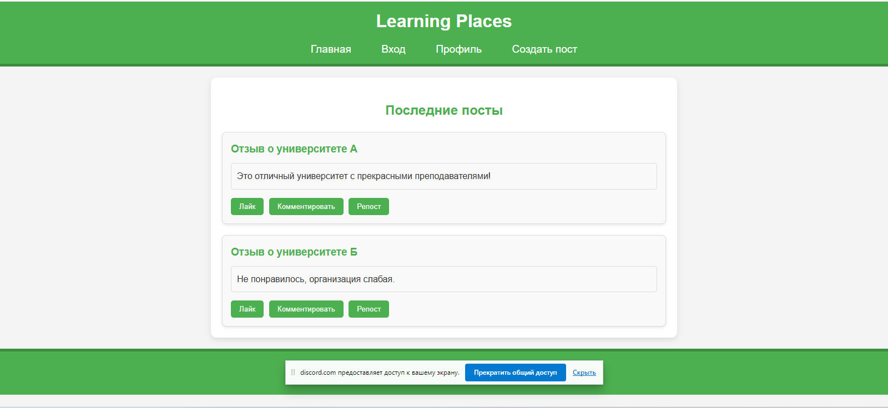

# Adv_prg_ass_1
# Learn Places

Learn Places — это веб-сайт в формате форума, где пользователи могут оставлять отзывы об учебных заведениях. Наша цель — создать платформу, на которой студенты, родители и преподаватели смогут делиться своими впечатлениями, опытом и рекомендациями.

## Основной функционал:
- **Добавление отзывов**: пользователи могут публиковать свои мнения об учебных заведениях.
- **Комментарии**: каждый отзыв можно прокомментировать, чтобы обсудить детали или задать вопросы.
- **Лайки**: поддержите понравившиеся отзывы, поставив лайк.
- **Репосты**: делитесь интересными отзывами с другими пользователями.

## Участники команды:
Мендияров Диас
Еркын Алдонгар 

## Скриншот:


## Установка и запуск:
1. Склонируйте репозиторий:
   ```bash
   git clone https://github.com/Adv_prg_ass_1.git
   ```
2. Перейдите в директорию проекта:
   ```bash
   cd Adv_prg_ass_1
   ```
3. Установите зависимости:
   ```bash
   go mod tidy
   ```
4. Запустите сервер:
   ```bash
   go run main.go
   ```
5. Откройте браузер и перейдите по адресу:
   ```
   http://localhost:8080
   ```

## Технологии:
- Go (Golang)
- PostgreSQL
- HTML/CSS/JavaScript
- Postman

## Лицензия:
Этот проект распространяется под лицензией MIT.
